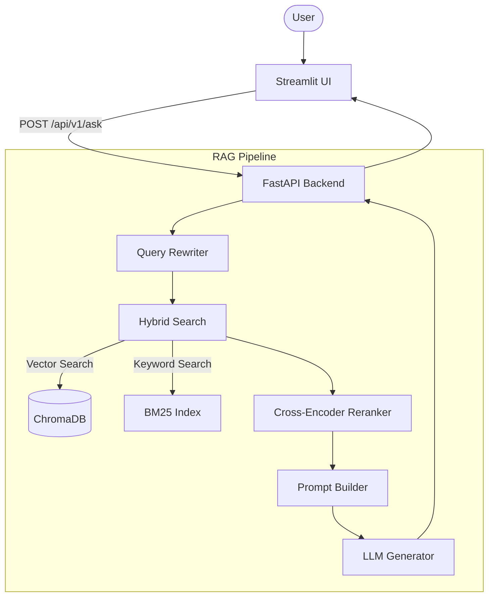

# Enterprise Knowledge Assistant

An advanced, production-ready Retrieval-Augmented Generation (RAG) application that allows employees to ask questions against a collection of internal company documents.

## 🌟 Key Features

* **Advanced RAG Pipeline**: Combines hybrid search (Keyword BM25 + Semantic Vector Search) with a true Cross-Encoder re-ranking step for maximum retrieval accuracy.
* **Conversation Memory**: Remembers past context and automatically rewrites queries based on conversational history.
* **Source Citations**: Every answer includes explicit citations to the source documents and pages it relied upon, completely eliminating untraceable hallucinations.
* **Evaluation Suite**: Built-in automated evaluation pipeline to measure Retrieval Accuracy, Response Time, and Confidence scores against ground-truth benchmarks.
* **User Feedback**: Allows users to upvote or downvote answers, saving telemetry for future fine-tuning.
* **Decoupled Architecture**: A clean separation of concerns between the FastAPI backend and the Streamlit frontend.

## 🏗️ Architecture Overview

The system is split into two primary services:
1. **FastAPI Backend**: Handles all heavy lifting (chunking, embedding, vector search, reranking, LLM generation, memory).
2. **Streamlit Frontend**: A lightweight UI that consumes the API.



## 📁 Project Structure

```text
.
├── app/                        # FastAPI Backend Application
│   ├── api/                    # API Routing and Schemas
│   ├── core/                   # RAG Engine (Memory, Retriever, Reranker, Hybrid Search)
│   ├── ingestion/              # PDF loading, parsing, and chunking logic
│   ├── llm/                    # Language Model generation integrations
│   ├── services/               # Core business logic orchestrated by the API
│   ├── vectorstore/            # ChromaDB integration and search index
│   └── main.py                 # FastAPI application entry point
├── ui/                         # Streamlit Frontend Application
│   ├── pages/                  # Additional pages (e.g., Evaluation)
│   ├── components.py           # Reusable UI widgets
│   ├── streamlit_app.py        # Main Chat UI entry point
│   └── styles.css              # Custom frontend styling
├── evaluation/                 # Automated Evaluation Suite
│   ├── evaluate.py             # Evaluation runner and metrics calculator
│   └── test_questions.json     # Ground-truth question and keyword pairs
├── documents/                  # Raw PDFs and text documents for ingestion
├── chroma_db/                  # Local persisted vector database
├── scripts/                    # Utility scripts
├── requirements.txt            # Python dependencies
├── System_Design_Document.md   # Architectural design details
└── README.md                   # You are here
```

## 🚀 Setup Instructions

### Prerequisites
* Python 3.10+
* An API key for your chosen LLM provider (e.g., Google Gemini or Groq)

### 1. Install Dependencies
```bash
python -m venv .venv
source .venv/bin/activate  # On Windows: .venv\Scripts\activate
pip install -r requirements.txt
```

### 2. Configure Environment Variables
Copy `.env.example` to `.env` and fill in your configuration:
```bash
cp .env.example .env
```
Ensure your `.env` file contains the required API keys for the LLM providers, for example:
```env
GOOGLE_API_KEY=your_gemini_api_key_here
GROQ_API_KEY=your_groq_api_key_here
CHROMA_DB_PATH=./vector_db
```

### 3. Run the Backend API
Start the FastAPI server (runs on port 8000 by default):
```bash
uvicorn app.main:app --reload
```

### 4. Run the Frontend UI
In a separate terminal window, start the Streamlit application (runs on port 8501):
```bash
streamlit run ui/streamlit_app.py
```

### 5. Ingest Sample Data
To test the system, you can use the provided sample documents located in the `documents/` folder. 
You can trigger the ingestion pipeline by calling the API (or via the UI if configured):
```bash
curl -X POST "http://127.0.0.1:8000/api/v1/ingest" \
     -H "Content-Type: application/json" \
     -d '{"directory": "./documents"}'
```
Once ingested, the documents will be chunked, embedded, and stored in the local `chroma_db/` vector database.

## 🛠️ Technology Choices

* **Backend Framework**: `FastAPI` (Chosen for high performance, async support, and automatic OpenAPI documentation)
* **Frontend UI**: `Streamlit` (Chosen for rapid prototyping of data applications)
* **LLM Integrations**: `Google Gemini` & `Groq` (Support for multiple state-of-the-art LLMs via their respective APIs to generate grounded, context-aware answers)
* **Embedding Models**: `Gemini Embeddings` or `Sentence-Transformers` (A provider-agnostic wrapper allows you to dynamically switch between remote embeddings like `models/gemini-embedding-2` and local models like `all-MiniLM-L6-v2`)
* **Vector Database**: `ChromaDB` (Chosen because it runs entirely locally/in-memory, requiring no external infrastructure setup, perfect for this assignment)
* **Search Strategy**: `Hybrid (Vector + BM25)` (Vector search handles semantic meaning, while BM25 handles exact keyword matches like names and acronyms)
* **Reranker**: `Sentence-Transformers (Cross-Encoder)` (Provides deep semantic scoring between the query and candidate chunks, vastly outperforming bi-encoders for scoring)

## 📐 Design Decisions

* **API-First Design**: By putting all RAG logic behind a REST API (`/api/v1/ask`), the core logic is entirely decoupled from the UI. This allows for easy integration into Slack bots, Teams, or custom web apps in the future.
* **Separation of Concerns**: The `app/core` directory contains pure pipeline logic (memory, retrieval, generation) completely independent of the FastAPI request/response lifecycle.
* **Aggressive Grounding**: The system is prompted to explicitly refuse to answer if the provided context does not contain the answer, ensuring zero hallucination on policy questions.

## ⚠️ Known Limitations

* **Local Scalability**: Currently, ChromaDB is running in a local persistent directory. For a true enterprise deployment, this would need to be migrated to a hosted Vector DB (e.g., Pinecone or Weaviate).
* **Synchronous Generation**: The LLM generation is currently synchronous. For long answers, the API blocks until the entire answer is generated.

## 🔮 Future Improvements

* **Authentication**: Add user authentication and role-based access control to the API and UI to secure the enterprise data.
* **Deployment**: Create production-ready deployment manifests (e.g., Kubernetes or managed cloud services) for scalable hosting.
* **Dockerization**: Wrap both the frontend and backend in a `docker-compose.yml` and `Dockerfile` for standardized, single-command deployment across any environment.
