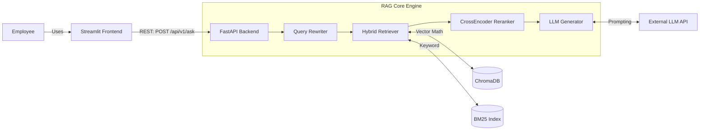

# System Design Document: Enterprise Knowledge Assistant

## 1. High-Level Architecture

The Enterprise Knowledge Assistant is designed as a decoupled, two-tier system consisting of a **Frontend Presentation Layer** (Streamlit) and a **Backend Service Layer** (FastAPI). 

This decoupled approach ensures that the RAG (Retrieval-Augmented Generation) engine can be scaled independently of the UI and can easily be integrated into other enterprise tools (like Slack, Microsoft Teams, or an internal portal) in the future.

### Architecture Diagram

---

## 2. Data Flow

### A. Ingestion Flow (Offline)
1. **Document Loading**: Raw internal documents (PDFs, TXT) are parsed.
2. **Chunking**: Text is split into overlapping chunks to preserve context across boundaries.
3. **Embedding**: Each chunk is converted into a dense vector embedding.
4. **Indexing**: 
   - Vectors and metadata (source file, page number) are stored in **ChromaDB**.
   - Raw text is tokenized and stored in a **BM25 Keyword Index**.

### B. Query Flow (Online)
1. **Request**: The employee asks a question in the Streamlit UI.
2. **Memory Injection**: The backend retrieves recent conversation history for the session.
3. **Query Rewriting**: An LLM rewrites the user's query to make it standalone (e.g., resolving pronouns like "it" based on history).
4. **Hybrid Retrieval**: 
   - Vector Search fetches chunks based on semantic meaning.
   - BM25 fetches chunks based on exact keyword matches.
   - The results are normalized and merged.
5. **Reranking**: A highly accurate Cross-Encoder model (`sentence-transformers`) scores the relevance of each retrieved chunk against the query, filtering out noise.
6. **Generation**: The top chunks are injected into a strict prompt template, instructing the LLM to answer *only* using the provided context.
7. **Response**: The final answer, along with structural citations (document names and pages), is returned to the UI.

---

## 3. Component Explanation

* **API Router (`app/api/`)**: Defines the REST contracts and Pydantic schemas. Keeps HTTP routing thin by delegating business logic to services.
* **Services (`app/services/`)**: Orchestrates the core engine, handles error translation (e.g., throwing HTTP 500s), and maps internal dataclasses to external API schemas.
* **Core RAG Engine (`app/core/`)**:
  * `query_rewriter.py`: Prevents multi-turn conversational breakdown.
  * `hybrid_search.py`: Combines dense (semantic) and sparse (keyword) retrieval to overcome the weaknesses of using vector search alone.
  * `reranker.py`: Acts as a quality gate, drastically reducing hallucinations by preventing irrelevant chunks from ever reaching the LLM.
  * `memory.py`: Manages short-term conversational context.
* **Vector Store (`app/vectorstore/`)**: An abstraction layer over ChromaDB, allowing the underlying database to be swapped out in the future without changing core logic.

---

## 4. Scalability Considerations

Currently, the system is designed to run locally, which is perfect for demonstration and moderate workloads. To scale this for an enterprise with thousands of employees and millions of documents, the following changes would be necessary:

1. **Stateless Backend Deployment**: 
   - The FastAPI backend must be deployed across multiple containers (e.g., Kubernetes) behind a load balancer. 
   - **Action**: Move the conversation memory out of local memory (`app/core/memory.py`) and into a fast, distributed cache like **Redis**.

2. **Managed Vector Database**:
   - The local SQLite-backed ChromaDB would become a bottleneck during concurrent writes/reads.
   - **Action**: Migrate to a managed, distributed vector database such as **Pinecone**, **Weaviate**, or **Qdrant**.

3. **Asynchronous Ingestion Worker**:
   - Processing large PDFs blocks the main API thread, which degrades user experience.
   - **Action**: Introduce a message broker (e.g., RabbitMQ or Redis) and use **Celery** workers to handle document chunking and embedding generation asynchronously.

4. **Streaming Inference**:
   - LLM generation takes time. As token counts grow, time-to-first-byte (TTFB) increases.
   - **Action**: Refactor the `/ask` endpoint to use Server-Sent Events (SSE) to stream the response back to the client token-by-token.
